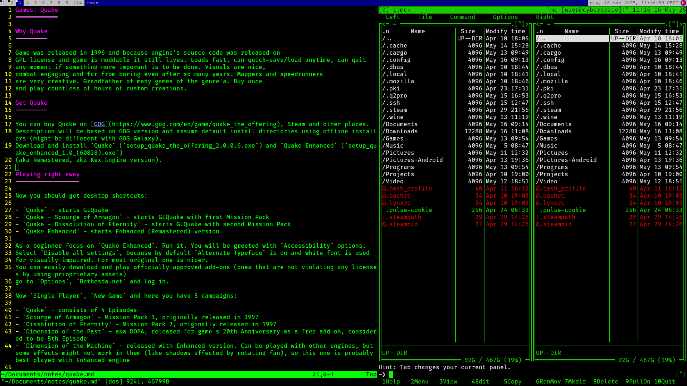

# Dotfiles

After x years I went full circle to basic WMs. Currently DWM again. Recently used KDE and Plasma but Kwin was able to crash whole X server while switching windows so...
Currently on Artix Linux I'm striving for simplest working config and using "stow" to apply it.
In separate (private) repo I've got notes how I've set everything up.

