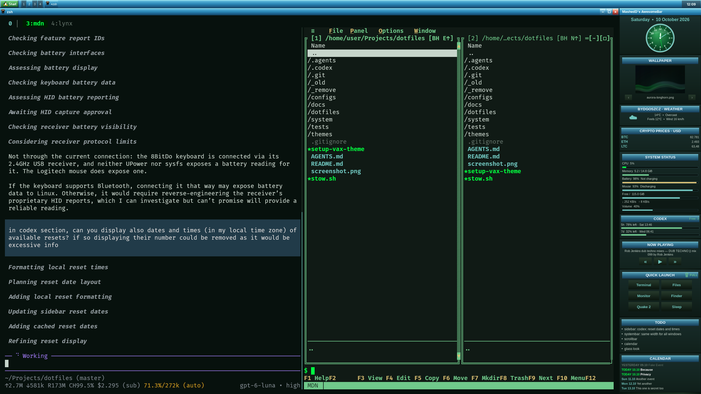

# Awesome floating-desktop dotfiles

This is the active desktop configuration for a CachyOS X11 session:

- AwesomeWM with four workspaces, floating windows and Win98/Matrix titlebars
- Native Awesome 30px Win98/Matrix top panel and XEmbed tray, with snixembed bridge
- kitty, xfce4-appfinder, pcmanfm, dunst, clipboard history, lxqt-policykit, and xss-lock/i3lock
- Chicago95 controls with Matrix-green (`#001a00` / `#00ff41`) active states
- HDMI-A-1-0 preferred at 2560×1440/144 Hz, with internal-display recovery

The repository also retains Openbox and legacy Hyprland, Waybar, Walker, Mako,
hyprlock, dwm, and st files for reference. They are not started by the active
session. The `openbox-*` helper names are retained for compatibility; Awesome
uses the same volume, display, brightness, clipboard, screenshot and lock tools.

## Screenshot status



The image above is an **obsolete Hyprland desktop reference**, not a picture of
the current Awesome session. Current screenshots are intentionally not claimed
until one is captured from this setup.

## Install and deploy

`Documents/cachyos.md` is the original installation history. It is deliberately
not modified by this repository. Its desktop package section, plus local
`pacman -Qo` ownership checks, are the source for the required X11 dependencies:

```text
stow awesome xsettingsd snixembed
xorg-xrandr xorg-xset xclip xdotool maim
xss-lock i3lock dunst clipmenu dmenu pcmanfm
gtk2 gtk3 fontconfig dbus util-linux
kitty xfce4-appfinder lxqt-policykit wireplumber brightnessctl
playerctl pavucontrol
```

Clipboard history uses `clipmenu` + `clipmenud` only. Clipman is disabled in
both session autostart and its XDG desktop entry; there is no fallback. If
clipmenu is absent, Win+V reports that history is unavailable rather than
launching Clipman. Microsoft Sans Serif is preferred; a weak
fontconfig alias uses Liberation Sans when the proprietary font is absent.

Optional application packages in the notes (games, development tools, office
software, and unrelated services) are not required by this desktop package.

Apply the Stow package first. Stow remains conflict-safe and never adopts an
existing file or symlink:

```sh
./stow.sh                 # dry-run preflight (same as ./stow.sh check)
./stow.sh apply           # preflight, then create/refresh Stow-owned links
./stow.sh unlink          # preflight, then remove only Stow-owned links
```

Chicago95 remains an external installation. Then generate the VAX overlay and
named panel icon separately:

```sh
./setup-vax-theme
./setup-vax-theme --path "/path/to/Chicago95"
~/.local/bin/openbox-check
```

The helper searches standard user and system theme directories, writes the
generated VAX theme to `${XDG_DATA_HOME:-~/.local/share}/themes/VAX`, and keeps
the GTK2 controls and a GTK3 Matrix-green selection wrapper. It creates a
compatibility `~/.themes/VAX` symlink only when that path is absent or is the
old repository-owned VAX symlink. Unmarked themes, files, icon paths, and
unrelated symlinks are refused. Re-run it after updating Chicago95.

`openbox-check` is read-only (the name is retained): it checks Awesome syntax
and reports required and optional commands,
assets, fonts, generated theme files, and helper executability. It never
installs packages, starts services, or changes settings.

The checker expects Microsoft Sans Serif or its Liberation Sans fallback
(for the Win98 UI) and the bundled FiraCode Nerd Font after Stow deployment.

This machine has four unrelated Stow conflicts that were deliberately left
untouched: two existing PCManFM files and two absolute helper symlinks. The
Awesome migration was applied with a conflict-safe preflight excluding them:

```sh
ignore='(^|/)(codex-usage|crypto-prices|desktop-items-0\.conf|pcmanfm\.conf)$'
stow --simulate --restow --dir "$PWD" --target "$HOME" --ignore="$ignore" dotfiles &&
  stow --restow --dir "$PWD" --target "$HOME" --ignore="$ignore" dotfiles
fc-cache -f
```

The normal `stow.sh` still refuses these conflicts; it never adopts or
overwrites them.

## Starting and validating Awesome

`startx` starts Awesome through `~/.config/X11/xinitrc`; `~/.xinitrc` also
forwards there when the login shell has not exported `XINITRC`. The session
uses the existing systemd user D-Bus bus. Do not wrap it in `dbus-run-session`.
Save work and log out of the old WM before running `startx`; deployment does
not replace or kill a live WM.

Awesome's built-in wibar replaces LXPanel **at the top, 30px high**, with
Win98-style square/bevelled controls, Matrix-green active elements, Start menu,
four-workspace buttons (scroll up = previous workspace; scroll down = next),
current-workspace taskbar (including minimized windows),
CPU graph, battery status, volume, tray and `Fri  DD.MM.YY  HH:MM:SS` clock
(localized abbreviated weekday, fixed width, bold 9pt text, one-second updates). Click the
clock for a Monday-first calendar; hover CPU/battery/clock for details.
Volume: left-click opens pavucontrol, right/middle-click mutes, scroll changes
volume using the same helper as the media keys. The complete 65×25 Start image
is rendered at native size without a duplicate text label. The native systray appears only
on the primary monitor; snixembed bridges SNI applications. LXPanel is no
longer autostarted. All normal/dialog windows still float with click-to-focus.
The Tux wallpaper is rendered by `gears.wallpaper` and reapplied on monitor
geometry changes; neither feh nor a wallpaper daemon is started.

```sh
awesome -k -c ~/.config/awesome/rc.lua
python3 tests/test-awesome-session.py  # private Xvfb/D-Bus; no live-session changes
```

Win+P opens the display menu: internal only, HDMI only, extended desktop, or
automatic hotplug layout. Explicit HDMI modes prefer 2560×1440/144 Hz; the
internal display stays enabled until a requested mode succeeds. Mouse: drag
titlebar to move, double-click to maximize, Win+left-drag to move,
Win+right-drag to resize. Titlebars have icon, title, minimize, maximize and
close. Alt+Space/right-click title opens window actions. Win+Left/Right snaps
a window to a screen half. Alt+Tab/Shift+Alt+Tab cycles; Alt+F4 closes;
Alt+F11 toggles fullscreen. Win+D toggles show-desktop. Ctrl+Alt+arrows switches
workspaces without wrapping; Win+Shift+arrows focuses directionally.
Win+Ctrl+R reloads Awesome without duplicating session services; **Win+Shift+Q
opens a Quit/Cancel confirmation**. Desktop right-click and the native Start button show the daily-tools
menu; Applications opens Awesome's built-in application launcher, and Run
opens xfce4-appfinder. Openbox-specific edge-resize/shade controls are not emulated;
use Win+right-drag anywhere or plain left-drag on the bottom-right grip for
resizing. Maximized/fullscreen windows hide the resize strip and borders;
unmaximizing restores them. The top panel hides while any window on that
monitor is fullscreen (e.g. YouTube video) and reappears on exit.

## AMD Xorg crash investigation (this laptop)

The October 6, 2026 10:10 crash was an AMD iGPU GPU-memory fault followed by
`gfx_0.0.0` timeout and Xorg SIGABRT in Mesa (`libgallium`) through Glamor.
The October 1 and October 8 crashes had the same fault/timeout on the dGPU.
The failure persisted on `7.2.9-1-cachyos` during ordinary desktop use and
recurred on `6.18.55-1-cachyos-lts` on October 9. LTS did not fix it.
This is not an Openbox crash; the exact underlying Mesa/kernel defect is not
yet identified.

See [the X11 stability trial](docs/x11-stability.md) for preserved evidence,
a controlled LTS-kernel test, boot-entry verification, acceptance checks and
recovery. LTS has now been boot-tested and failed; see the
[crash report draft](docs/x11-crash-report.md) for both-kernel evidence.
No further speculative graphics changes are being applied.

Disabling Glamor was tested and **broke HDMI**: both RandR providers advertised
`cap: 0x0`, preventing the dGPU output provider from attaching to the iGPU.
Do not use `AccelMethod "none"` on this hybrid-GPU setup.
`system/X11/xorg.conf.d/10-amdgpu.conf` now preserves acceleration and the
original working layout; it is hardware-specific and not Stowed. It does not
claim to fix the underlying GPU fault.

From the repository root, with the X session stopped:

```sh
sudo cp -a /etc/X11/xorg.conf.d/10-amdgpu.conf \
  /etc/X11/xorg.conf.d/10-amdgpu.conf.bak-$(date +%Y%m%d-%H%M%S)
sudo install -m 644 system/X11/xorg.conf.d/10-amdgpu.conf /etc/X11/xorg.conf.d/10-amdgpu.conf
startx
```

After starting X, verify nonzero provider capabilities and HDMI visibility,
then test kitty, HDMI hotplug, internal-panel fallback and locking:

```sh
xrandr --listproviders
xrandr --current
journalctl -k -b --since today | grep -E 'page fault|ring .*timeout|Process Xorg'
```

To undo the failed October 6 workaround, restore the known working backup:

```sh
sudo cp -a /etc/X11/xorg.conf.d/10-amdgpu.conf.bak-20261006-101509 /etc/X11/xorg.conf.d/10-amdgpu.conf
```

Save work and log out before restarting X. `openbox --reconfigure` cannot
apply Xorg driver options. The installed `linux-cachyos-lts` kernel was tested
and reproduced the crash; do not treat selecting it as a fix.

The display helper now uses `xrandr --current` to read hotplug-updated server
state without hardware/EDID probing on every poll (the previous Xorg log
had grown to 47 MB). This reduces unnecessary driver activity; it is not
proof that polling caused the GPU faults. Since faults also persist on LTS,
preserve fresh journal/core evidence and use the report draft for
maintainer-guided driver isolation; avoid partial Arch package upgrades.

## Shortcuts

- Win+1–4: switch desktop; Win+Shift+1–4: move focused window and follow
- Win+Enter: kitty; Win+R: application finder; Win+E: pcmanfm
- Win+L: lock screen; Win+P: output menu; Win+Shift+Q: confirmed quit
- Print: full screenshot; Alt+Print: focused window; Shift+Print: selected region
- Media and brightness keys use the Openbox helper bindings
- Awesome desktop menu: **Reapply Display Layout** runs the same serialized layout pass

Screenshots are captured into `~/Pictures/Screenshots` only after a successful
capture, then copied to the clipboard. A cancelled region selection leaves
existing clipboard contents and saved screenshots unchanged; a clipboard
failure keeps the saved PNG and prints its path.

## Session behavior and reloads

Awesome autostart preserves the existing systemd user D-Bus session, leaves
the externally managed NetworkManager applet untouched, uses Awesome's native
tray as the sole owner, and leaves removable-drive handling unchanged. The display watcher is asynchronous,
single-instance, polls every three seconds, and exits if the X server vanishes.
The same Openbox session services are retained: xsettingsd, display watcher,
battery alerts, snixembed, Solaar (when installed, hidden startup window),
dunst, lxqt-policykit, clipmenud when installed,
and xss-lock. Syncthing, MPD and the conditional notes HTTP server from the old
xinitrc are also retained. Only LXPanel and feh are replaced by built-in widgets
and wallpaper rendering. User applications that were not autostarted before
(e.g. Firefox/Gajim) are not newly autostarted.

Win+L and xss-lock share the lock helper. It passes the sleep descriptor to
i3lock, waits until unlock, prevents competing lock instances, uses a private
temporary Tux image and removes it afterward. If conversion fails, it still
locks with Win98 teal. The ten-minute X11 idle timer and suspend locking remain.

After changing deployed configuration:

```sh
awesome-client 'awesome.restart()'
dunstctl reload
```

A new login starts the autostart services; do not launch duplicate panel,
notification, clipboard, display-watcher, or lock daemons manually.
